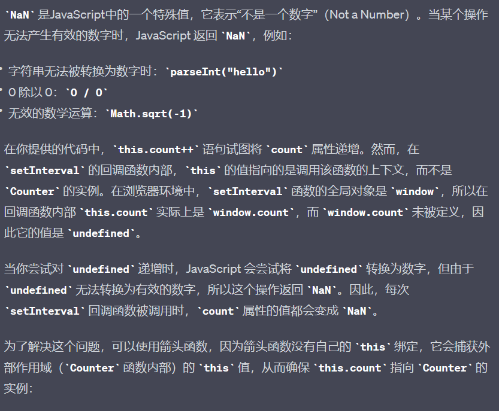

# 箭头函数

### 语法
这样的箭头函数省略了'function'关键字,是函数的定义更加简洁
```javascript
//传统函数
function add(a, b) {
    return a + b;
}
//箭头函数
const add = (a, b) => a + b;
```

### 隐式返回
当函数体只有一个表达式时，箭头函数会省略return关键字
```javascript
//传统函数
function add(a, b) {
    return a + b;
}
//箭头函数
const add = (a, b) => a + b;
```

### this的绑定

1. 全局上下文中，'this'指向全局对象
2. 在普通函数中，'this'通常指向调用的函数的对象。
3. 当函数作为对象的方法被调用时，this 指向调用该方法的对象。
4. 在普通函数中，this的值是在运行时确定的，它可以被改变。但是，在箭头函数中，this的值是在定义函数时确定的，它会捕获所属上下文的this值。
```javascript
   function Counter() {
    this.count = 0;
    setInterval(function() {
        this.count++; // 这里的 this 是全局对象，不是 Counter 的实例
        console.log(this.count);
    }, 1000);
}

const counter = new Counter(); // 输出NaN
```

```javascript
function Counter() {
    this.count = 0;
    setInterval(() => {
        this.count++; // this 指向 Counter 的实例
        console.log(this.count);
    }, 1000);
}

const counter = new Counter(); // 每秒输出递增的整数
```
# 模板字符串
在模板字符串中，使用``包裹字符串，而不是''或者""。这样可以在字符串中使用`${}`语法来插入变量或表达式，这些被`${}`包裹的部分会被计算并嵌入到字符串中。

示例：
```javascript
const name = "World";
const word = `Hello, ${name}!`;

console.log(word); // 输出：Hello, World!
```

### 多行文本
模板字符串还可以包含多行文本，传统的字符串常常需要使用`/n`来表示换行，但是在模板字符串中，可以直接在反引号中换行，文本会保留原始的格式 
```javascript
const word = `
    This is a
    multi-line
    string.
`;

console.log(word);
// 输出：
//     This is a
//     multi-line
//     string.
```

### 插入表达式
模板字符串不仅可以插入变量，还可以插入任意的JavaScript表达式。这样可以在字符串中执行一些操作，然后将结果插入到字符串中

示例：
```javascript
const a = 10;
const b = 5;

const result = `数字 ${a} 和 ${b} 的和是 ${a + b}。`;

console.log(result); // 输出：数字 10 和 5 的和是 15。
```


# 解构赋值

### 数组解构赋值

使用数组解构赋值，你可以通过位置将数组中的值赋给变量。

```javascript
const numbers = [1, 2, 3];
const [a, b, c] = numbers;//以逗号为间隔，按照下标来一一对照

console.log(a); // 输出：1
console.log(b); // 输出：2
console.log(c); // 输出：3
```

### 对象解构赋值

对象解构赋值允许你从对象中提取属性，并将其赋给变量，变量的名字与对象的属性名相对应。

```javascript
const person = { name: '小李', age: 18 };
const { name, age } = person;

console.log(name); // 输出：小李
console.log(age); // 输出：18

//为变量指定名称
const person = { name: '小李', age: 18 };
const { name: personName, age: personAge } = person;

console.log(personName); // 输出：小李
console.log(personAge); // 输出：18
```

### 函数参数解构
```javascript
//函数解构
const person = { name: '小李', gender: 18 };

function word({ name, gender }) {
    console.log(`你好, ${name}! 手术很成功，你已经是个${gender}生了`);
}

word(person); // 输出：你好，小李！手术很成功，你已经是个女生了。
```

### 补充
```javascript
//剩余操作符
const numbers = [1, 2, 3, 4, 5];
const [first, ...rest] = numbers;

console.log(first); // 输出：1
console.log(rest); // 输出：[2, 3, 4, 5]
//注：剩余操作符同样可以为变量指定名称
```

# promise

Promise 是一种用于处理异步操作的对象，它代表了一个尚未完成但预期将来会完成的操作。Promise 可以处于三种状态之一：

- **Pending（进行中）**：初始状态，表示操作尚未完成。
- **Fulfilled（已成功）**：表示操作已经完成并且成功返回了结果。
- **Rejected（已失败）**：表示操作在某些步骤中发生了错误。

## 创建一个 Promise

### 使用 Promise 构造函数来创建一个 Promise 对象：

```javascript
const myPromise = new Promise((resolve, reject) => {
    // 异步操作，比如从服务器获取数据
    const data = fetchData();

    if (data) {
        resolve(data); // 成功，将结果传递给then方法
    } else {
        reject(""); // 失败，将错误信息传递给catch方法
    }
});
```
## 处理Promise
Promise 可以使用 then() 方法处理 Fulfilled 状态，使用 catch() 方法处理 Rejected 状态。也可以使用 finally() 方法在 Promise 完成后无论成功还是失败都执行一段代码。

```javascript
 myPromise
    .then(data => {
        console.log(data); // 处理成功的结果
    })
    .catch(error => {
        console.error(error); // 处理失败的错误信息
    })
    .finally(() => {
        console.log(""); // 无论成功还是失败都会执行的代码
    });
```

## Promise的链式调用
Promise 允许链式调用，可以在一个 Promise 的 then() 方法中返回另一个 Promise，实现连续的异步操作

```javascript
const fetchData = () => {
    return new Promise((resolve, reject) => {
        // 异步操作
        if (success) {
            resolve(data);
        } else {
            reject(error);
        }
    });
};

fetchData()
    .then(data => {
        return processData(data);//processData为另一个promise
    })
    .then(result => {
        console.log(result);
    })
    .catch(error => {
        console.error(error);
    });

```