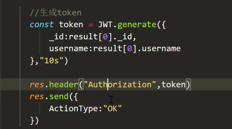

# 项目大纲
## 初始化项目
### 1.1  vue create 创建项目   
### 1.2 删去不必要的组件
### 1.3 创建一级路由
```js
import { createRouter, createWebHashHistory } from 'vue-router'
import login from '../views/login.vue'
import mainBox from '../views/mainBox.vue'
import Home from '../views/home/Home.vue'
import center from '../views/center/center.vue'
const routes = [
 {
  path:'/login',
  name:"Login",
  component:login
 },
 {
  path:'/mainBox',
  name:"mainBox",
  component:mainBox
 }

]
const router = createRouter({
  history: createWebHashHistory(),
  routes
})
export default router
```
### 1.4 创建config.js放子路由
```js
import Home from '../views/home/Home.vue'
import center from '../views/center/center.vue'

const routesConfig=[
    {
        path:'/index',
        component:Home

    },
    {
        path:"/center",
        component:center
    }
]
export default routesConfig
```
### 1.5 遍历动态导入子路由
```JS
routesConfig.forEach(element => {
  router.addRoute("mainBox",element)

});
```
### 1.6 配置路由守卫
```js
// 初始化时添加路由
routesConfig.forEach(element => {
  router.addRoute("mainBox", element)
})

// 配置路由守卫
router.beforeEach((to, from, next) => {
  if (to.name === "Login") {
    next()
  } else {
    if (!localStorage.getItem('token')) {
      next({ path: "/login" })
    } else {
      next()
    }
  }
})

```
### 1.7 配置404页面,根路径重定向
```js
 {
    path:'/:pathMatch(.*)*',
    name:'Notfound',
    component:NotFound

}

  {
        path:'/',
        redirect:"/index"
    },
```

## 2 登录页
### 2.1安装elemnet-plus
```js
npm install element-plus

import ElementPlus from 'element-plus'
import 'element-plus/dist/index.css'
```
### 2.2 搭建基本登录页面
### 2.3 登录函数校验
```js
 const submitForm = () => {
       loginFormRef.value.validate((valid)=>{
        if(valid){
            console.log(loginForm)
            //校验数据
            //拿到数据
            //发送后台
            localStorage.setItem("token","xurui")
            router.push('/index')
        }
       })
    }
```
## 3 配置主界面
###  3.1 element-puls引入布局
>将组件分别封装到component
```js
<template>
  <div>
     <el-container>
      <SideMenu></SideMenu>
      <el-container direction="vertical">
        <TopHeader></TopHeader>
        <el-main><router-view></router-view></el-main>
      </el-container>
    </el-container>

    
  </div>
</template>

<script setup>
import TopHeader from '@/components/mainbox/TopHeader'
import SideMenu from '@/components/mainbox/SideMenu'

</script>
```
###  3.2折叠动画，store
```js
<script setup>
import { useStore } from 'vuex'
const store = useStore()

const change =()=>{
    store.commit("changeCollapsed")
}
</script>
```
###  3.3 vuex持久化插件
> npm install vuex-persistedstate
导入
```js
import { createStore } from 'vuex'
import createPersistedState from 'vuex-persistedstate'
export default createStore({
  state: {
    isCollapsed:false
  },
  getters: {
  },
  mutations: {
    changeCollapsed(state) {
      state.isCollapsed=!state.isCollapsed
    }
  },
  actions: {

  },

  modules: {

  },
  plugins:[createPersistedState()]
})
```
###  3.4 5秒实现路由跳转
```js
 <el-menu
        default-active="2"
        class="el-menu-vertical-demo"
        :collapse="$store.state.isCollapsed"
        :collapse-transition="false"
        :router="true"
      >
```

##  4. 实现导航条效果

 ###  组件库导入效果

```js
<template>
    
<el-header>
    <div class="left">
        <el-icon><Menu /></el-icon>
        <span class="manage">企业门户管理系统</span>
    </div> 

    <div class="right">
        <span>欢迎 admin</span >
  <el-dropdown>
    <span class="el-dropdown-link">
      <el-icon :size="30"><User /></el-icon>
      
    </span>
    <template #dropdown>
      <el-dropdown-menu>
        <el-dropdown-item>个人中心</el-dropdown-item>
        <el-dropdown-item>退出</el-dropdown-item>
      </el-dropdown-menu>
    </template>
  </el-dropdown>
    </div>
</el-header>
    
</template>

<script setup>
import { useStore } from 'vuex'
import{Menu ,User}from '@element-plus/icons-vue'
const store = useStore()

const change =()=>{
    store.commit("changeCollapsed")
}
</script>

<style lang="scss" scoped>
.el-header{
background-color: #2d3a4b;
color: white;
width: 100%;
height: 60px;
line-height: 60px;
display: flex;
justify-content: space-between;
align-items: center;

}
.left,.right{
    display: flex;
}
.left{
    i{
        margin: auto;
    }
}
.right{
    .el-dropdown{
        margin: auto;
    }
}
.manage{
    margin-left: 10px;
}

</style>
```
## 3.5 跳转和登出
```js
const handleCenter=()=>{
    router.push('/center')
}
const handlelogout=()=>{
    localStorage.removeItem("token")
    router.push('/login')
}
```
### 4.Node.js
## 4.1 serve node.js接口
> 1. npm i express-generator -g   
> 2. express server    
> 3.  cd ./server/   
> 4. npm i
## 4.2 前后端互通
```js
axios.get('/users').then(res=>{
                console.log(res.data)
            })
```
解决跨域问题
```js
// 在vue.config中做反向代理
//或者cors中间件解决跨越问题
const { defineConfig } = require('@vue/cli-service')
module.exports = defineConfig({
  transpileDependencies: true,

  devServer: {
    proxy: {
      "/users": {
        target: "http://localhost:3000",
        changeOrigin:true
      }
    }
  }
})
```
## 4.3 使用mogoose创建用户模型
在models中创建UserModel.js
```js

const mongoose = require("mongoose")

const Schema = mongoose.Schema

const UseType = {
    username: String,
    password: String,
    gender: Number,
    interoduction: String,
    avatar: String,
    role:Number //管理员1 ，编辑2
}
mongoose.model("user")
const UserModel = mongoose.model("user", new Schema(UseType))
module.exports=UserModel
```
## 4.4 写login接口
在routes文件夹中创建UserRouter.js
```js
var express = require('express');
const UserController = require('../../controller/admin/UserController');
var UseRouter = express.Router();

/* GET home page. */
UseRouter.post('/adminapi/user/login', UserController.login);

module.exports = router;
```
>UseRouter.post('/adminapi/user/login', UserController.login);
当用户请求`/adminapi/user/login `接口时，回调`UserController.login`方法    
`UserController`是校验前端请求的数据的js文件
```js
const UserService = require("../../services/admin/UserService")

const UserController = {
    login: async(req,res) => {
         //拿前端数据
        await UserService.login(req.body) //进行数据库查询
    }
}
module.exports=UserController
```
`UserService.login(req.body)` 拿前端数据发送到`UserService`进行数据库的查询操作 

注册路由    
```js
app.use(UserRoute)
```
## 4.5 token
>npm i jsonwebtoken    
     在views下创建util
  ```js
  const jsonwebtoken = require("jsonwebtoken")
const secret = "xurui"
const JWT = {
  //生成token函数
    generate(value, exprires) {
        return jsonwebtoken.sign(value,secret,{expiresIn:exprires})
    },
  //验证token函数  
    verify(token) {
        jsonwebtoken.verify(token,secret)
    }
}
```

```设置header   ``` 


## 4.5 axios拦截器
该干嘛干嘛 

### 5. Home界面